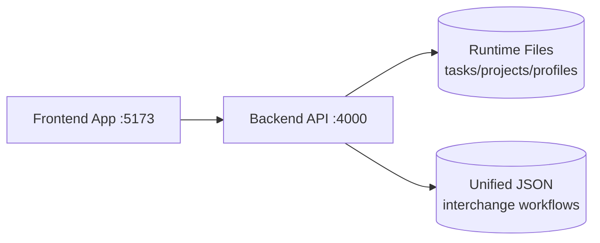

# Architecture

**Last updated:** 2026-05-04  
**Owner:** Engineering

---

## System Overview

Focista Schedulo is a TypeScript monorepo with:

- `backend`: Express API, validation, persistence, normalization, analytics endpoints
- `frontend`: React application for profile/task/project/progress workflows

---

## Runtime Topology

---

## Persistence Strategy

### Runtime (Primary)

- `backend/data/tasks.runtime.json`
- `backend/data/projects.runtime.json`
- `backend/data/profiles.runtime.json`

Used for frequent operational mutations and read paths.

### Interchange (Secondary)

- `backend/data/focista-unified-data.json`

Used for import/export/admin interoperability workflows.

---

## Backend Responsibilities

- API contracts and request validation
- Recurrence identity normalization (parent/child determinism)
- Profile/project/task scope integrity
- Stats and productivity aggregate computation (local-calendar semantics; weekly series keyed `last7Days` is seven **Monday–Sunday** buckets; see `API_CONTRACTS.md`)
- Safe persistence with debounced flush strategy
- Read-only showcase profile policy enforcement for mutation endpoints

Primary implementation: `backend/src/index.ts`

---

## Frontend Responsibilities

- Profile-scoped task/project rendering
- Optimistic action handling for responsiveness
- Batch mutation orchestration
- Calendar and historical task UX
- Progress and productivity analysis presentation
- Friendly error translation for toaster UX via shared formatter utility

Primary implementation:

- `frontend/src/App.tsx`
- `frontend/src/components/TaskBoard.tsx`
- `frontend/src/components/ProfileManagement.tsx`
- `frontend/src/components/GamificationPanel.tsx`
- `frontend/src/components/ProductivityAnalysisModal.tsx`

---

## Reliability and Performance Patterns

- Batch endpoints for high-volume mutations
- Debounced/coalesced persistence writes
- Silent reconciliation refreshes after optimistic UI updates
- Instrumentation for action latency diagnostics

---

## Architectural Constraints

- Local-first file persistence (no cloud DB in current scope)
- Single-user operational model
- Interchange file support preserved for portability

