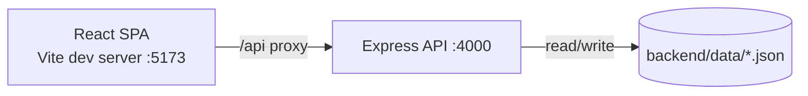

# Architecture — Focista Schedulo

**Last updated**: 2026-03-18  
**Owner**: Engineering  

## Overview

Focista Schedulo is a TypeScript monorepo with:

- **Backend**: Node.js + Express REST API with JSON-file persistence
- **Frontend**: React + Vite SPA with list + calendar views
- **Shared**: reserved workspace entry for shared types/utilities (currently minimal)

## Repository structure

- `backend/`
  - `src/index.ts`: Express server, schemas, persistence, migrations, recurrence identity rules, stats
  - `data/tasks.json`, `data/projects.json`: persisted data (dev/local)
- `frontend/`
  - `src/App.tsx`: app shell/branding, cross-component refresh triggers
  - `src/components/TaskBoard.tsx`: list, calendar month view, day agenda view, export, task actions
  - `src/components/TaskEditorDrawer.tsx`: task edit/create + voice parsing
  - `src/components/ProjectSidebar.tsx`: project CRUD + change events
  - `src/components/GamificationPanel.tsx`: `/api/stats` display
  - `src/styles.css`: global theme + component styles (Indonesian palette)

## Runtime topology

## Data model (summary)

See `VARIABLES.md` for full definitions.

- **Project**: `{ id: "P<number>", name }`
- **Task**: rich fields including `priority`, `dueDate`, `dueTime`, `durationMinutes`, `repeat*`, `projectId`, `completed`, `parentId`, `childId`, `cancelled`

## Persistence and migrations

Backend persists to JSON files:

- `backend/data/projects.json`
- `backend/data/tasks.json`

On server start (`loadData()`):

- Creates `backend/data/` if missing.
- Loads tasks/projects with Zod validation.
- **Project ID normalization**:
  - Resequences all projects to strict `P1..Pn`
  - Migrates `task.projectId` references accordingly
- **Series normalization (repeating tasks)**:
  - Ensures each series has stable `parentId`
  - Ensures `childId` exists and is sequential by `dueDate`
  - Ensures `durationMinutes` is consistent within the series
- **Parent ID standardization (all tasks)**:
  - Enforces `parentId` format `YYYYMMDD-N` for one-time and repeating tasks

These migrations are intended to be **deterministic** and safe to run repeatedly.

## Recurrence and identity strategy

Recurring tasks have two key identity dimensions:

- **Series identity** (shared across occurrences):
  - `parentId` (standardized `YYYYMMDD-N`)
  - `seriesKey` (derived): `projectId :: title :: repeat :: repeatEvery :: repeatUnit`
- **Occurrence identity**:
  - `childId` (standardized `${parentId}-${index}`)

The frontend may create a “virtual upcoming occurrence” for display. When the user interacts with it (open/edit/complete), it is materialized into a real backend task while preserving series identity.

Deletion of repeating items uses a **cancellation** strategy (`cancelled: true`) to prevent re-appearance from recurrence expansion logic.

## API surface

### Health

- `GET /health` → `{ status: "ok", service: "focista-schedulo-backend" }`

### Projects

- `GET /api/projects`
- `POST /api/projects` (body: `{ name }`) → creates `P<number>`
- `PUT /api/projects/:id` (body: `{ name }`)
- `DELETE /api/projects/:id` → deletes project + its tasks

### Tasks

- `GET /api/tasks?projectId=P1` (optional filter)
- `POST /api/tasks` (create)
- `PUT /api/tasks/:id` (update)
- `DELETE /api/tasks/:id` (delete; recurring tasks may be cancelled instead depending on UI behavior)

### Stats

- `GET /api/stats` → stats used by Progress panel (points, level, streak, etc.)

## Frontend state synchronization

The UI uses a lightweight event mechanism:

- `pst:tasks-changed`
- `pst:projects-changed`

Components dispatch these events after CRUD actions and listen to them to refetch and synchronize state.

Additionally, the app refreshes when:

- window gains focus
- tab visibility changes

This reduces “stale association” issues (e.g., project rename reflected on task cards).

## Build and dev

- Dev:
  - API runs on `:4000`
  - UI runs on `:5173` and proxies `/api` to backend
- Scripts live in root `package.json`:
  - `npm run dev`
  - `npm run build`
  - `npm run lint`

