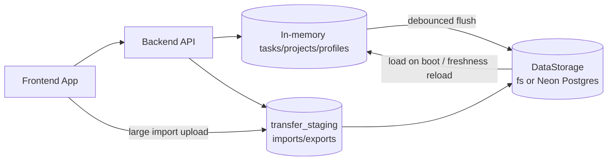
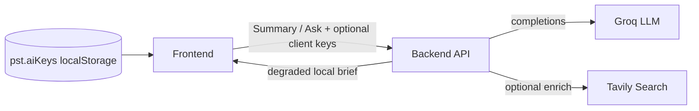

# Architecture

**Last updated:** 2026-07-19  
**Owner:** Engineering

---

## Purpose

Describe the current system architecture, runtime topology, data flow, and persistence strategy for Focista Schedulo.

---

## System Overview

Focista Schedulo is a TypeScript monorepo with:

| Package / Area | Role |
|---|---|
| `backend` | Express API, validation, persistence, normalization, analytics endpoints |
| `frontend` | React application for profile/task/project/progress workflows |
| `backend/src/storage` | Pluggable persistence (`fs` for local dev, **Neon Postgres** for Prod) |
| `backend/src/transferStaging.ts` | Large import/export staging via Neon `transfer_staging` |
| `backend/src/importParse.ts` | Per-row import validation and soft coercion |
| `backend/src/productivitySummaryService.ts` | AI Summary/Ask digests, Groq/Tavily orchestration |
| `docs/` | Professional product and engineering documentation suite |

---

## Runtime Topology

**Production:** UI on Vercel; API on a Node host (or Vercel Services); primary durable store = **Neon Postgres Free** (row-per-task). No Redis, no MongoDB, no required disk volume on the API host.

### External AI services (optional)

- Server env: `GROQ_API_KEY`, optional `GROQ_MODEL`, optional `TAVILY_API_KEY`.
- Client may send `groqApiKey` / `tavilyApiKey` from **AI keys** modal; keys are never logged.
- On Groq failure, Summary/Ask may return a **local digest** with `degraded: true`.

---

## Persistence Strategy

### Runtime (Primary)

| Environment | Store | Shape |
|---|---|---|
| Local / `STORAGE_BACKEND=fs` | `backend/data/*.runtime.json` | Split JSON files (tasks / projects / profiles) |
| Prod / `STORAGE_BACKEND=neon` | Neon Postgres Free | Relational tables + `payload jsonb` per task |

Neon tables (see `backend/src/storage/migrations/001_neon_core.sql`):

- `profiles`, `projects` — small relational rows
- `tasks` — **one row per task**; canonical `payload` = full TaskSchema; generated filter columns
- `runtime_meta` — `tasks_revision` / `projects_revision` / `profiles_revision` for multi-isolate freshness
- `transfer_staging` — temporary large import/export payloads (TTL)

Write debounce:

| Backend | Debounce |
|---|---|
| `fs` (local) | ~40ms |
| `neon` on long-running Node | ~200ms |
| `neon` when `VERCEL` is set | **`0`** — serverless freezes timers after the HTTP response; mutations that must survive (especially complete) **await** flush before responding |

### Multi-isolate Neon freshness (Vercel)

Each serverless isolate keeps its own in-memory `tasks`. Before `GET /api/tasks` and `PATCH /api/tasks/:id/complete`, the API calls `ensureTasksMemoryFresh()`:

1. Peek `runtime_meta.tasks_revision` (with `NEON_FRESHNESS_TTL_MS` cooldown).
2. If remote revision is newer than this isolate’s last known revision, reload via `loadData()`.
3. Skip the check while local dirty flags / persist are in flight.

This prevents completion toggles from appearing to succeed then snap back when another isolate had newer Neon state.

Production boot may load **profiles** via a fast path before the large tasks working set to improve time-to-interactive.

### Interchange (Secondary)

- `focista-unified-data.json`

Used for import/export/admin interoperability workflows (bootstrap / sync sources). Not the primary high-frequency write path.

### Storage backends

| Backend | When | Notes |
|---|---|---|
| `fs` | Local default | `backend/data/`; supports `fs.watch` hot reload |
| `neon` | Prod with `DATABASE_URL` | Row store; no file watcher; migrations on first use |

Selection: `STORAGE_BACKEND` or auto (`DATABASE_URL` present → Neon) via `backend/src/storage/createStorage.ts`. Invalid storage backend values are rejected at startup.

### Large transfer path

| Direction | Mechanism |
|---|---|
| Import | Client may upload via `POST /api/admin/transfer-upload`, then `POST /api/admin/import` with `stagingPathname` (xor `content`); rows validated via `importParse.ts` |
| Export | API may stage to Neon and return a download URL (`delivery: "staging"`); or `delivery: "parts"` + `POST /api/admin/export-tasks-page` when staging is unavailable |
| Upload helper | `POST /api/admin/transfer-upload` |

---

## Backend Responsibilities

- API contracts and request validation (Zod)
- Recurrence identity normalization (parent/child determinism)
- Profile/project/task scope integrity
- Stats and productivity aggregate computation (local-calendar semantics; weekly series keyed `last7Days` is seven **Monday–Sunday** buckets)
- Monthly/Yearly Grinding and badges-earned milestone computation
- Safe persistence with debounced flush strategy via `DataStorage` (**await** critical persists on Vercel; debounce `0` when `VERCEL` is set)
- Neon multi-isolate task freshness reload before list/complete (`ensureTasksMemoryFresh` via `tasks_revision`)
- Read-only showcase profile policy enforcement for mutation endpoints
- Neon `transfer_staging` for large import/export

Primary implementation: `backend/src/index.ts`  
Storage adapters: `backend/src/storage/` (`neonStorage.ts`, `fsStorage`, migrations)  
Domain modules: `monthlyGrinding.ts`, `yearlyGrinding.ts`, `badgesEarnedMilestone.ts`, `capMilestoneBadges.ts`, `profileService.ts`, `profileSecurity.ts`, `transferStaging.ts`, `productivitySummaryService.ts`

---

## Frontend Responsibilities

- Profile-scoped task/project rendering
- Optimistic action handling for responsiveness
- Batch mutation orchestration
- Calendar and historical task UX
- Progress and productivity analysis presentation
- AI Productivity Summary modal (period summaries + task Q&A)
- Friendly error translation for toaster UX
- **Single-toast** queue; toast enqueue dismisses exclusive tooltips
- Exclusive tooltip/hovercard slot (`uiExclusiveOverlay.ts`) shared across TaskBoard, Progress, and Analysis
- Automated sync/save after import (`autoSyncAndSave`); quiet reload on tab return
- Large import client upload (`transferImport.ts`)
- Staged boot progress feedback

Primary implementation:

- `frontend/src/App.tsx`
- `frontend/src/apiClient.ts`
- `frontend/src/transferImport.ts`
- `frontend/src/uiExclusiveOverlay.ts`
- `frontend/src/utils/friendlyError.ts`
- `frontend/src/components/TaskBoard.tsx`
- `frontend/src/components/ProfileManagement.tsx`
- `frontend/src/components/GamificationPanel.tsx`
- `frontend/src/components/ProductivityAnalysisModal.tsx`
- `frontend/src/components/ProductivitySummaryModal.tsx`
- `frontend/src/components/TaskEditorDrawer.tsx`
- `frontend/src/components/ProjectSidebar.tsx`
- `frontend/src/components/BadgesModalDialogBody.tsx`
- `frontend/src/components/badgePngExport.ts`
- `frontend/src/components/Toaster.tsx`

---

## Reliability and Performance Patterns

- Batch endpoints for high-volume mutations
- Debounced/coalesced persistence writes (Neon debounce `0` on Vercel serverless)
- Critical mutations (task complete) await durable flush before HTTP success on Vercel (single-row upsert on Neon)
- Silent reconciliation refreshes after optimistic UI updates
- Instrumentation for action latency diagnostics (`X-Server-Time-Ms`, optional FE slow-action logging)
- Avoid expensive full sync/save on every boot; automate after import
- Neon Free: accept scale-to-zero cold starts; no artificial keep-alive

---

## Architectural Constraints

- Prod durable store is **Neon Postgres Free** (row-per-task); local remains `fs` JSON — **no Redis / MongoDB** in current Prod topology
- Single-user operational model
- Interchange file support preserved for portability
- Long-running API process required for SSE and in-memory working set (or serverless isolates + Neon freshness)
- Legacy API key names may diverge from semantics (`last7Days`) — document, do not casually rename

---

## Related Documents

- Deployment: `DEPLOYMENT_VERCEL.md`
- API: `API_CONTRACTS.md`
- Variables: `VARIABLES.md`
- Guardrails: `GUARDRAILS.md`
- Crosswalk: `DOCS_CODE_CROSSWALK.md`
- Plan: `plans/2026-07-19-neon-postgres.md`
