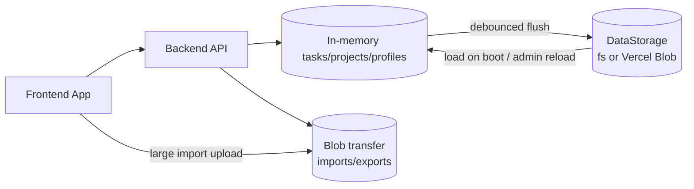

# Architecture

**Last updated:** 2026-07-18  
**Owner:** Engineering

---

## Purpose

Describe the current system architecture, runtime topology, data flow, and persistence strategy for Focista Schedulo.

---

## System Overview

Focista Schedulo is a TypeScript monorepo with:

| Package / Area | Role |
|---|---|
| `backend` | Express API, validation, persistence, normalization, analytics endpoints |
| `frontend` | React application for profile/task/project/progress workflows |
| `backend/src/storage` | Pluggable persistence (`fs` for local dev, **Vercel Blob** for Prod) |
| `backend/src/blobTransfer.ts` | Large import/export staging via Blob |
| `docs/` | Professional product and engineering documentation suite |

---

## Runtime Topology

**Production (Option A):** UI on Vercel; API on a Node host (or Vercel Services); primary durable store = **Vercel Blob** (no Redis, no MongoDB, no required disk volume).

---

## Persistence Strategy

### Runtime (Primary)

Split JSON objects (same schema locally and in Blob):

- `tasks.runtime.json`
- `projects.runtime.json`
- `profiles.runtime.json`

Used for frequent operational mutations and read paths. Writes are debounced (`~40ms` on `fs`, `~1500ms` on `vercel-blob`).

Production boot may load **profiles** via a fast path before the large tasks object to improve time-to-interactive.

### Interchange (Secondary)

- `focista-unified-data.json`

Used for import/export/admin interoperability workflows (bootstrap / sync sources). Not the primary high-frequency write path.

### Storage backends

| Backend | When | Notes |
|---|---|---|
| `fs` | Local default | `backend/data/`; supports `fs.watch` hot reload |
| `vercel-blob` | Prod with Blob credentials | Object store under `BLOB_RUNTIME_PREFIX`; no file watcher |

Selection: `STORAGE_BACKEND` or auto-detect Blob credentials (`backend/src/storage/createStorage.ts`).

### Large transfer path

| Direction | Mechanism |
|---|---|
| Import | Client may upload to Blob, then `POST /api/admin/import` with `blobPathname` (xor `content`) |
| Export | API may return short-lived presigned download URL when inline body would exceed limits |
| Upload helper | `POST /api/admin/blob-upload` |

---

## Backend Responsibilities

- API contracts and request validation (Zod)
- Recurrence identity normalization (parent/child determinism)
- Profile/project/task scope integrity
- Stats and productivity aggregate computation (local-calendar semantics; weekly series keyed `last7Days` is seven **Monday–Sunday** buckets)
- Monthly/Yearly Grinding and badges-earned milestone computation
- Safe persistence with debounced flush strategy via `DataStorage`
- Read-only showcase profile policy enforcement for mutation endpoints
- Blob staging for large import/export

Primary implementation: `backend/src/index.ts`  
Storage adapters: `backend/src/storage/`  
Domain modules: `monthlyGrinding.ts`, `yearlyGrinding.ts`, `badgesEarnedMilestone.ts`, `capMilestoneBadges.ts`, `profileService.ts`, `profileSecurity.ts`, `blobTransfer.ts`

---

## Frontend Responsibilities

- Profile-scoped task/project rendering
- Optimistic action handling for responsiveness
- Batch mutation orchestration
- Calendar and historical task UX
- Progress and productivity analysis presentation
- Friendly error translation for toaster UX
- **Single-toast** queue; toast enqueue dismisses exclusive tooltips
- Exclusive tooltip/hovercard slot (`uiExclusiveOverlay.ts`) shared across TaskBoard, Progress, and Analysis
- Automated sync/save after import (`autoSyncAndSave`); quiet reload on tab return
- Large import client upload (`blobImport.ts`)
- Staged boot progress feedback

Primary implementation:

- `frontend/src/App.tsx`
- `frontend/src/apiClient.ts`
- `frontend/src/blobImport.ts`
- `frontend/src/uiExclusiveOverlay.ts`
- `frontend/src/utils/friendlyError.ts`
- `frontend/src/components/TaskBoard.tsx`
- `frontend/src/components/ProfileManagement.tsx`
- `frontend/src/components/GamificationPanel.tsx`
- `frontend/src/components/ProductivityAnalysisModal.tsx`
- `frontend/src/components/TaskEditorDrawer.tsx`
- `frontend/src/components/ProjectSidebar.tsx`
- `frontend/src/components/BadgesModalDialogBody.tsx`
- `frontend/src/components/badgePngExport.ts`
- `frontend/src/components/Toaster.tsx`

---

## Reliability and Performance Patterns

- Batch endpoints for high-volume mutations
- Debounced/coalesced persistence writes (longer debounce on Blob)
- Silent reconciliation refreshes after optimistic UI updates
- Instrumentation for action latency diagnostics (`X-Server-Time-Ms`, optional FE slow-action logging)
- Avoid expensive full sync/save on every boot; automate after import

---

## Architectural Constraints

- JSON-document persistence (local files or Vercel Blob) — **no Redis / MongoDB** in current Prod topology
- Single-user operational model
- Interchange file support preserved for portability
- Long-running API process required for SSE and in-memory working set
- Legacy API key names may diverge from semantics (`last7Days`) — document, do not casually rename

---

## Related Documents

- Deployment: `DEPLOYMENT_VERCEL.md`
- API: `API_CONTRACTS.md`
- Variables: `VARIABLES.md`
- Guardrails: `GUARDRAILS.md`
- Crosswalk: `DOCS_CODE_CROSSWALK.md`
