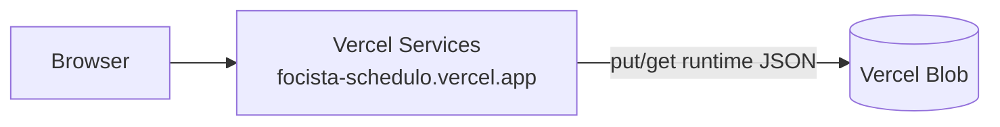

# Production deployment on Vercel (full-stack guidance)

**Last updated:** 2026-07-18  
**Owner:** Engineering

---

## 1) What you are deploying

Focista Schedulo is a **split architecture**:

| Layer | Technology | Role |
|---|---|---|
| UI | React + Vite (`frontend/`) | Browser SPA; talks to HTTP APIs |
| API | Express + TypeScript (`backend/`) | Validates input, applies business rules, persists JSON runtime objects |
| Storage (Prod) | **Vercel Blob** (Hobby free tier) | Durable object store for `*.runtime.json` (no Redis, no MongoDB) |
| Storage (Dev) | Local disk `backend/data/` | Same JSON shape; hot-reload via `fs.watch` |

**Vercel hosts the static/Vite frontend.** The Express API remains a **long-running Node process** on any Node host (Fly.io, Render, Railway, VPS, etc.). Persistence in production uses **Vercel Blob** so the API host does **not** need a persistent disk volume.

**Recommended production topology**

1. **Vercel Services (same project / same domain):** Vite frontend + Express backend routed via `vercel.json` `services` + rewrites.
2. **Vercel Blob:** durable runtime JSON (`STORAGE_BACKEND=vercel-blob`).
3. **Same-origin API:** leave `VITE_API_BASE_URL` unset so the SPA calls `/api` on the Vercel host.

Alternative **split hosting** (UI on Vercel, API elsewhere) still works: set `REQUIRE_VITE_API_BASE_URL=1` and `VITE_API_BASE_URL`, plus `FRONTEND_ORIGIN` on the API host.
---

## 2) “Local storage” in this product (current reality)

The app already uses the browser for **some** local persistence:

- **Active profile id** is stored in `localStorage` (`pst.activeProfileId` in `frontend/src/App.tsx`).
- **Import** reads a user-selected file in the browser, then posts content to `/api/admin/import`.
- **Export** requests a snapshot from `/api/admin/export-data` and downloads blobs in the browser.

**Important distinction**

- **Local-first UX** (files + browser storage for preferences) is already part of the experience.
- **Fully offline / no server** operation would require a large engineering effort (IndexedDB adapter). That is **not** shipped in the current codebase.

---

## 3) Frontend: Vercel configuration

### Repository layout

Use the Vercel project **Root Directory**: `frontend/`.

### Build settings

Configured in `frontend/vercel.json`:

- **Framework:** Vite
- **Build command:** `npm run build`
- **Output directory:** `dist`
- **SPA rewrites:** unknown paths → `index.html`

### Required environment variable (Production)

Set in Vercel → Project → Settings → Environment Variables (**Production**):

| Name | Example | Purpose |
|---|---|---|
| `VITE_API_BASE_URL` | `https://api.yourdomain.com` | Absolute origin of the Express API **without** a trailing slash |

At build time, Vite inlines this value. Production builds on Vercel **fail** if `VITE_API_BASE_URL` is missing or not an absolute URL (`frontend/vite.config.ts`).

**Development note:** leave `VITE_API_BASE_URL` unset locally so `window.location.origin` is used and the Vite dev proxy (`vite.config.ts`) continues to forward `/api` to `localhost:4000`.

---

## 4) Backend: production host checklist

### Process

- Run `npm run build` then `npm run start` (or run `ts-node-dev` only in dev).
- Expose port `4000` (or set `PORT`).
- Set `NODE_ENV=production` or `FOCISTA_ENV=production`.

### Persistence (Vercel Blob — no Redis / no MongoDB)

Create a **Private** Blob store in the Vercel dashboard (Storage → Blob). Copy `BLOB_READ_WRITE_TOKEN` onto the **API host** (the token works from any Node process, not only Vercel Functions).

| Name | Example | Purpose |
|---|---|---|
| `STORAGE_BACKEND` | `vercel-blob` | Force Blob persistence (recommended in Prod) |
| `BLOB_READ_WRITE_TOKEN` | `vercel_blob_rw_…` | Read/write credential for the Blob store |
| `BLOB_RUNTIME_PREFIX` | `focista-schedulo/runtime/` | Optional pathname prefix for runtime JSON |
| `BLOB_ACCESS` | `private` | Must match the store access mode |

Runtime objects written:

- `tasks.runtime.json`
- `projects.runtime.json`
- `profiles.runtime.json`

Local `fs` remains the default when no Blob credentials are present (`STORAGE_BACKEND=fs` or unset).

**Free-tier note:** Hobby includes limited advanced operations (uploads). The Blob adapter uses a **1.5s debounce** and multipart uploads for large task dumps. Prefer batched UI mutations; avoid tight write loops.

### CORS / browser security

| Name | Example | Purpose |
|---|---|---|
| `FRONTEND_ORIGIN` | `https://your-app.vercel.app` | Restrict CORS to your deployed UI origin |

**Required in production** (`NODE_ENV=production` or `FOCISTA_ENV=production`). If unset in production, the API process exits on startup.

---

## 5) Operational limitations to plan for

| Topic | Guidance |
|---|---|
| **SSE** (`/api/events`) | Works when UI and API share an origin **or** when API CORS allows the UI origin. Validate cross-origin EventSource from the Vercel domain. |
| **Large imports / exports** | Vercel Hobby caps serverless request/response bodies (~4.5MB). Large transfers use **Vercel Blob staging**: client upload → `/api/admin/import` with `blobPathname`; export returns a short-lived presigned Blob URL. |
| **Blob size / ops** | Full-file rewrites of large `tasks.runtime.json` count as uploads; monitor Hobby quotas. |
| **Hot reload** | `fs.watch` is **disabled** on Blob; use admin reload/sync or process restart after external Blob edits. |
| **Secrets** | Never commit tokens or `.env` files. Configure secrets in Vercel/API host dashboards only. |

---

## 6) Verification checklist (staging / Prod)

- [ ] UI loads from Vercel domain
- [ ] API `/health` reports `"storage":"vercel-blob"`
- [ ] Create/edit/complete/delete task works end-to-end
- [ ] Import JSON + CSV works; post-import auto sync/save completes (no Sync/Save header buttons)
- [ ] Export JSON + CSV + Both works
- [ ] Large import via Blob staging (`blobPathname`) works when payload exceeds inline limits
- [ ] Large export returns a usable short-lived Blob download URL when applicable
- [ ] `413` friendly messaging appears if Blob transfer is misconfigured for oversized payloads
- [ ] Boot shows staged profile loading progress; profiles can load before large tasks blob
- [ ] Progress panel (`/api/stats`) matches active profile scope (calendar-week chart)
- [ ] Productivity insights (`/api/productivity-insights`) loads for the active profile
- [ ] SSE / Progress panel live updates work from the Vercel origin
- [ ] Runtime objects appear under the Blob store prefix in the Vercel dashboard
- [ ] `FRONTEND_ORIGIN` set; `VITE_API_BASE_URL` set if split-hosted Production

---

## 7) Roadmap: true offline / IndexedDB “local storage”

If the goal is **no hosted API** in production:

1. Introduce a `StorageAdapter` interface (remote REST vs local IndexedDB).
2. Port merge/dedupe/import/export semantics carefully (today centralized in `backend/src/index.ts`).
3. Add conflict resolution UX for multi-tab usage.
4. Add automated tests for parity between modes.

This is a substantial project; do not assume it is implied by deploying the UI to Vercel alone.
