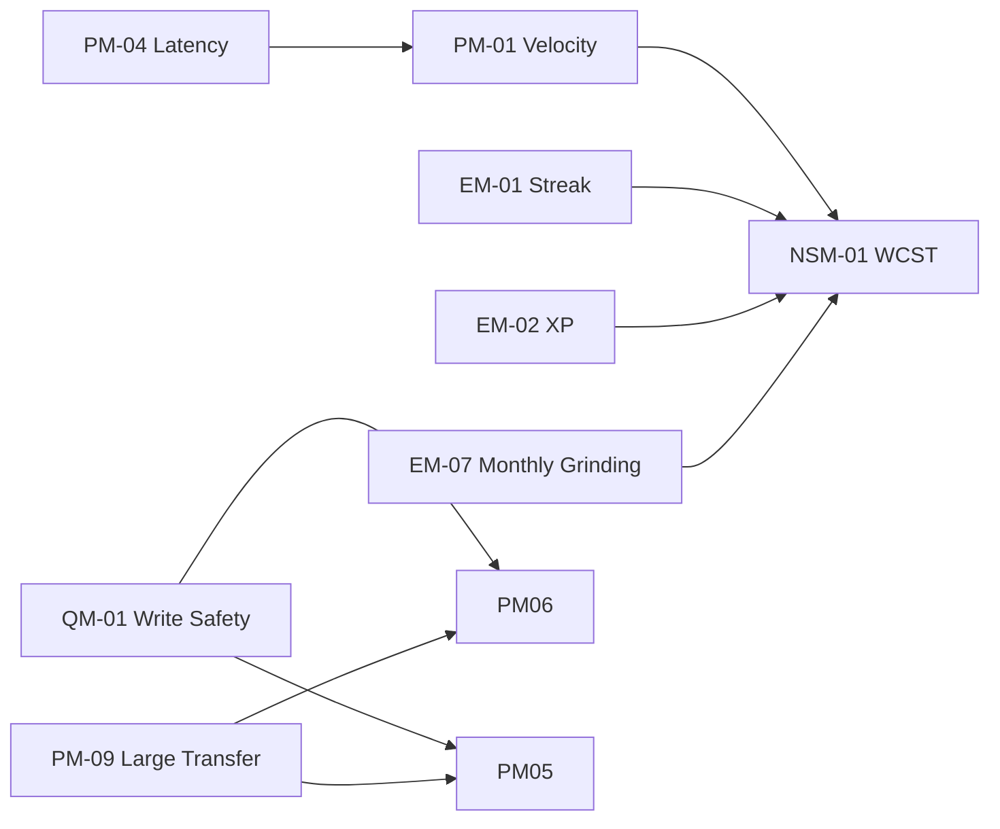

# Product Metrics

**Last updated:** 2026-07-19  
**Owner:** Product Analytics

---

## Purpose

Define the product KPI dictionary for Focista Schedulo: what we measure, why it matters, how it is calculated, where it is observed, and how it informs OKRs.

Formula authority for domain variables: `VARIABLES.md`.

---

## North-Star Metric

### NSM-01: Weekly Completed Scoped Tasks (WCST)

| Field | Value |
|---|---|
| **Definition** | Number of completed tasks per calendar week in active profile scope (or all profiles when unscoped). |
| **Why it matters** | Captures real execution, not just task creation. |
| **Formula** | Count of tasks with `completed = true` whose progress day falls in the evaluation week. Progress day = `dueDate` else local date(`completedAt`). |
| **Location** | Derived from runtime tasks via `/api/stats` and `/api/productivity-insights` |
| **Example** | `28` completed tasks in the week of 2026-07-13 (Mon) through 2026-07-19 (Sun) for profile `PR-…` |
| **Target direction** | Up |

---

## Core Product Metrics

| Metric ID | Metric Name | Definition | Formula | Location / Signal | Target Direction | Example |
|---|---|---|---|---|---|---|
| PM-01 | Task Completion Velocity | Completed tasks per active week | `count(completed tasks in week)` | Stats/insights; WCST sibling | Up | `28 / week` |
| PM-02 | Profile Scope Integrity | Share of checks without cross-profile leakage | `1 - (scope defects / scope checks)` | Manual + release audit | Up | `1.00` |
| PM-03 | Recurrence Integrity Rate | Recurring operations without duplicate/missing defects | `successful recurrence ops / total recurrence ops` | Recurrence regression suite | Up | `0.99` |
| PM-04 | Action Latency Compliance | Share of critical actions under 1 second | `actions < 1000ms / total critical actions` | Frontend timing + `X-Server-Time-Ms` | Up | `0.92` |
| PM-05 | Export Reliability | Successful export operations ratio | `successful exports / export attempts` | Admin export + UI | Up | `0.98` |
| PM-06 | Import Reliability | Successful imports without data corruption | `successful imports / import attempts` | Admin import + post-import auto sync/save | Up | `0.97` |
| PM-07 | Error Clarity Coverage | Share of failed user actions with friendly root-cause copy | `friendly errors / total surfaced errors` | `friendlyError.ts` audit | Up | `1.00` |
| PM-08 | Showcase Integrity | Share of blocked mutations correctly prevented for showcase profile | `blocked showcase writes / showcase write attempts` | `Test` profile regression | Up | `1.00` |
| PM-09 | Large Transfer Success | Success rate of Blob-staged import/export when payload exceeds inline limits | `successful blob transfers / blob transfer attempts` | `blobTransfer.ts`, admin import/export | Up | `0.95` |
| PM-10 | Boot Progress Completeness | Share of boots that reach interactive state without user-abort | `completed boots / boot attempts` | Profile load progress UI | Up | `0.99` |

---

## Secondary Engagement Metrics

| Metric ID | Metric Name | Definition | Formula / Observation | Example |
|---|---|---|---|---|
| EM-01 | Streak Continuity | Distribution trend of `streakDays` | Median/percentile of `stats.streakDays` | Median `6` |
| EM-02 | XP Gain Momentum | Weekly change in XP | `Δ totalPoints` week-over-week; include `pointsToday` | `+55 XP / week` |
| EM-03 | Productivity Insight Usage | Frequency of Analysis feature use | Opens of Productivity Analysis modal (instrument when available) | `3 opens / user / week` |
| EM-04 | Bulk Action Adoption | Share of task maintenance via batch operations | `batch mutations / (batch + single mutations)` | `0.35` |
| EM-05 | Progress Chart Engagement | Sessions with weekly chart hover/open | Instrumentation proxy when enabled | Qualitative until instrumented |
| EM-06 | Badge Export Adoption | Share of badge-modal sessions that export PNG | `png exports / badge modal opens` | `0.20` |
| EM-07 | Monthly Grinding Attainment | Share of active months with `weeksCompleted >= 4` | From yearly/monthly grinding formulas | `2 / 7 months YTD` |
| EM-08 | Achievement Clarity | Share of achievement/milestone cards showing non-empty plain-English `description` | `cards with description / total cards` | `1.00` |
| EM-09 | Productivity Summary Usage | Frequency of AI Summary / Ask use | Opens of Productivity Summary modal + successful generate/ask | `2 opens / user / week` |
| EM-10 | Task Search Adoption | Share of sessions using free-text task search | Search interactions / active sessions (when instrumented) | Qualitative until instrumented |

---

## Quality Metrics

| Metric ID | Metric Name | Definition | Formula / Observation | Example |
|---|---|---|---|---|
| QM-01 | Data Write Safety | No invalid or destructive persistence events | Incident count of corrupt/wipe events = `0` | `0` incidents / release |
| QM-02 | API Contract Stability | Contract-breaking changes per release | Count of breaking changes without versioning/docs | `0` |
| QM-03 | Runtime Persistence Efficiency | Write coalescing effectiveness under high activity | Debounced flushes vs mutation rate | Fewer Blob puts than mutations |
| QM-04 | Docs-Code Parity | Unresolved mismatches in crosswalk audit | Count of open discrepancies | `0` at release close |
| QM-05 | Test Gate Pass Rate | Backend suite + lint/build green rate for release candidates | `passing gates / gate runs` | `1.00` |

---

## Metric Relationships

---

## Reporting Cadence

| Cadence | Metrics |
|---|---|
| Weekly | PM-01, PM-04, EM-02, NSM-01 |
| Bi-weekly | PM-02, PM-03, QM-01, PM-07, PM-08 |
| Monthly | PM-05, PM-06, PM-09, PM-10, QM-02, QM-03, QM-04, EM-03, EM-05, EM-06, EM-07 |
| Release-close | Full KPI set + QM-05 |

---

## Related Documents

- Variables: `VARIABLES.md`
- OKRs: `METRICS_AND_OKRS.md`
- Traceability: `TRACEABILITY_MATRIX.md`
