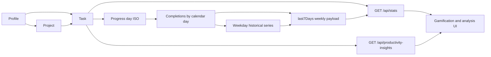

# Variables Documentation

**Last updated:** 2026-05-04  
**Owner:** Product Analytics + Engineering

This catalog defines core application variables with professional, implementation-aligned descriptions.

---

## Variable Relationship Chart

---

## Entity Variables

### Profile Variables

| Variable Name | Friendly Name | Definition | Formula | App Location | Example |
|---|---|---|---|---|---|
| `profile.id` | Profile Identifier | Unique profile key used for scoping projects/tasks/progress. | n/a | backend profile routes, frontend active profile state | `pf_01` |
| `profile.name` | Profile Name | User-facing profile label. | n/a | Profile hub UI, profile scoping header | `Rifqi Tjahyono` |
| `profile.title` | Profile Title | Secondary profile descriptor. | n/a | Profile hub, active profile display | `Product Builder` |
| `profile.passwordHash` | Profile Security Hash | Optional hashed password for locked profile access/export control. | hash(password) | backend profile security layer | `$scrypt$...` |

### Project Variables

| Variable Name | Friendly Name | Definition | Formula | App Location | Example |
|---|---|---|---|---|---|
| `project.id` | Project Identifier | Stable project key. | normalized sequence | project sidebar, task association | `P3` |
| `project.name` | Project Name | User-defined project label. | n/a | project sidebar, filters, move dialog | `Workstream Alpha` |
| `project.profileId` | Project Profile Scope | Profile owner of project. | n/a | backend filters + frontend project loading | `pf_01` |

### Task Variables

| Variable Name | Friendly Name | Definition | Formula | App Location | Example |
|---|---|---|---|---|---|
| `task.id` | Task Identifier | Unique persisted task ID. | n/a | task CRUD APIs and list rendering | `t_89ab` |
| `task.title` | Task Title | Primary actionable label for a task. | n/a | task card, editor, hovercard | `Prepare sprint plan` |
| `task.priority` | Priority | Urgency level for planning and XP scoring. | enum | task UI + stats scoring | `high` |
| `task.dueDate` | Scheduled Date | Planned day for execution. | n/a | list/calendar/progress bucketing | `2026-05-02` |
| `task.dueTime` | Scheduled Time | Planned start time. | n/a | day agenda/time displays | `09:00` |
| `task.durationMinutes` | Duration Minutes | Planned effort duration. | n/a | editor, agenda blocks, hover details | `90` |
| `task.repeat` | Recurrence Type | Repeat strategy for recurring tasks. | enum | recurrence logic and UI | `weekly` |
| `task.repeatEvery` | Recurrence Interval | Custom repeat interval factor. | n/a | custom repeat settings | `2` |
| `task.repeatUnit` | Recurrence Unit | Unit for custom interval. | enum | recurrence settings | `week` |
| `task.labels` | Labels | Categorization tags. | n/a | chips, search/filter context | `["deep-work","planning"]` |
| `task.location` | Location Value | Optional location context text/URL payload. | n/a | hovercard/editor | `Office` |
| `task.link` | External Links | Optional list of reference links. | n/a | hovercard/editor | `["https://example.com"]` |
| `task.profileId` | Task Profile Scope | Profile owner of task. | project/profile derived integrity rule | backend scope filters, frontend active profile | `pf_01` |
| `task.projectId` | Task Project Scope | Project association for grouping/filtering. | n/a | project filters and cards | `P3` |
| `task.completed` | Completion Flag | Completion state for execution and scoring. | boolean toggle | list status filters, stats APIs | `true` |
| `task.completedAt` | Completion Timestamp | Completion event timestamp. | now() on complete | analytics/recovery logic | `2026-04-30T12:01:00.000Z` |
| `task.parentId` | Series Parent ID | Deterministic recurring-series parent key. | normalization function | recurrence grouping | `20260430-3` |
| `task.childId` | Series Child ID | Sequence identifier within recurring series. | normalization function | occurrence-level operations | `7` |

---

## Derived and Formula Variables

| Variable Name | Friendly Name | Definition | Formula | App Location | Example |
|---|---|---|---|---|---|
| `completionDateIsoLocalForTask` | Progress Day | Day bucket key for completed task metrics. | `dueDate` else local date(`completedAt`) | backend stats and insights | `2026-04-30` |
| `stats.totalPoints` | Lifetime XP | Total weighted points over completed tasks. | sum(priorityWeight(task.priority)) | `/api/stats` | `420` |
| `stats.level` | Gamification Level | Progress level based on lifetime XP. | `1 + floor(totalPoints / 50)` | `/api/stats`, gamification UI | `9` |
| `stats.xpToNext` | XP To Next Level | Remaining points until next level threshold. | `50 - (totalPoints % 50)` (or 50) | `/api/stats` | `30` |
| `stats.completedToday` | Completed Today | Completed tasks mapped to today’s progress day. | count(progressDay == today) | gamification panel | `4` |
| `stats.streakDays` | Streak Days | Consecutive days with >=1 completion. | backward count over progressDay buckets | gamification panel | `6` |
| `activeProfileName` | Active Profile Name | Currently selected profile name used for policy gates in UI. | lookup(profile.id == activeProfileId).name | `TaskBoard.tsx`, `ProjectSidebar.tsx` | `Test` |
| `isShowcaseReadOnlyActive` | Showcase Read-only Flag | Boolean guard that disables mutation interactions for profile `Test`. | `lower(trim(activeProfileName)) == "test"` | `TaskBoard.tsx`, `ProjectSidebar.tsx`, `ProfileManagement.tsx` | `true` |
| `SHOWCASE_READONLY_MESSAGE` | Showcase Policy Message | Canonical backend message for blocked read-only profile mutations. | constant string | `backend/src/index.ts` | `Showcase mode: profile "Test" is read-only...` |
| `friendlyErrorMessage` | Friendly Error Message | Human-readable error root cause shown in toaster UI. | `backendError || fallbackByStatus(httpStatus)` | `frontend/src/utils/friendlyError.ts` | `Verification failed. Please re-check your password...` |

---

## `/api/stats` response variables (weekly series and tooltips)

The JSON key `last7Days` is a **legacy name**. Shipped behavior: an ordered array of **seven** objects for the **current calendar week** in the server’s local timezone (**Monday through Sunday**), not a rolling trailing-seven-day window.

| Variable Name | Friendly Name | Definition | Formula / derivation | App Location | Example |
|---|---|---|---|---|---|
| `stats.last7Days` | Weekly progress series | Seven day-buckets for charting and achievement checks that iterate this array. | Week starts at Monday 00:00 local (`mondayOffset` from `now`), then `toIsoLocal(addDaysLocal(weekStart, i))` for `i = 0..6` | `backend/src/index.ts` (`GET /api/stats`), `GamificationPanel.tsx` | Array length `7` |
| `stats.last7Days[].date` | Series day | ISO calendar date for the bar. | Local date string `YYYY-MM-DD` | stats payload, chart axis | `2026-05-04` |
| `stats.last7Days[].completed` | Completions count | Tasks completed on that progress day. | count of `completedTasksWithDate` where `completionDateIso === date` | chart height, tooltip | `3` |
| `stats.last7Days[].points` | Day XP | Sum of priority weights for tasks completed that day. | `sum(scoreFor(task))` for day’s tasks | tooltip, achievements | `7` |
| `stats.last7Days[].taskXpMin` | Per-task XP minimum | Smallest priority score among tasks completed that day. | `min(xps)` or `null` if no completions | rich tooltip | `2` |
| `stats.last7Days[].taskXpMax` | Per-task XP maximum | Largest priority score among tasks completed that day. | `max(xps)` or `null` | rich tooltip | `4` |
| `stats.last7Days[].taskXpAvg` | Per-task XP average | Mean priority score for tasks completed that day (one decimal). | `round((points / n) * 10) / 10` or `null` | rich tooltip | `2.7` |
| `stats.last7Days[].weekdayTaskMin` | Weekday historical minimum | Min completions on this **weekday** (0=Sun … 6=Sat) across every calendar day from first completion through `now`, including zero-completion days. | `min(count per that weekday)` | rich tooltip | `0` |
| `stats.last7Days[].weekdayTaskMax` | Weekday historical maximum | Max completions on this weekday over the same span. | `max(count per that weekday)` | rich tooltip | `5` |
| `stats.last7Days[].weekdayTaskAvg` | Weekday historical average | Mean completions for this weekday (one decimal). | `round(mean * 10) / 10` | rich tooltip | `2.4` |

**Implementation note:** Achievements that loop over `last7Days` (for example Consistency Builder progress) therefore use the **same seven calendar-week dates** as the weekly chart, not an independent rolling seven-day window. Product copy that refers to “last seven days” should be reconciled with this behavior in a future wording pass.

---

## Notes on Source of Truth

- Runtime entity truth is persisted in split runtime JSON files:
  - `tasks.runtime.json`
  - `projects.runtime.json`
  - `profiles.runtime.json`
- Metrics truth is computed server-side from persisted runtime entities.
- Unified JSON is interchange-oriented and not the primary runtime mutation store.
- Error-message source of truth is the shared friendly formatter in `frontend/src/utils/friendlyError.ts`.

