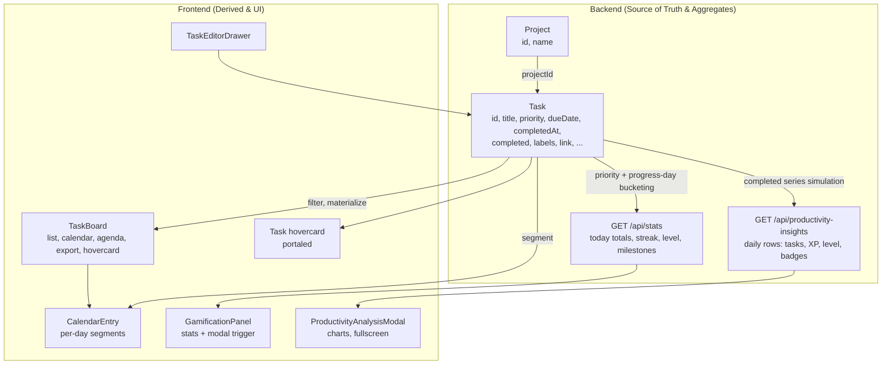

# Variables Catalog — Focista Schedulo

**Last updated:** 2026-04-01  
**Owner:** Product Analytics (with Engineering)

This document defines the key **variables** used across the product: stored fields, derived values, and product metrics. Each variable is documented with a **variable name**, **friendly name**, **definition**, **formula** (when applicable), **location in the app**, **source of truth**, and **example** to align product, analytics, and engineering.

---

## Entities and Storage

- **Backend persistence:** JSON files in `backend/data/`
  - `tasks.json` — source of truth for tasks
  - `projects.json` — source of truth for projects
- **Frontend-derived variables:** Built in React for calendar segmentation, grouping, sorting, filtering, and export formatting.

---

## Variable Relationship Chart

The following diagram shows how main entities and variables connect and flow through the application.

### Relationship Summary

| From | To | Relationship |
|------|-----|--------------|
| `project.id` | `task.projectId` | Task belongs to a project; filter and display by project. |
| `task.parentId` | `task.childId` | Series identity; occurrences share parentId and use backend-normalized child sequence IDs. |
| `task.dueDate` + `task.dueTime` + `task.durationMinutes` | `CalendarEntry` | Frontend segments tasks into per-day calendar blocks. |
| `task.priority` | `stats` points | Points per completion: low=1, medium=2, high=3, urgent=4. |
| `task.completed` + **`task.dueDate`** (else `task.completedAt` → local day) | `stats.completedToday`, `stats.pointsToday`, `stats.streakDays` | Day buckets use **due date** for progress when set; undated completions use completion timestamp. |
| `task` (all fields) | Hovercard, Export | Full task data shown in hovercard and export output. |
| `task` (completed, due date / completion day, priority) | `productivity-insights.rows[]` | Backend expands completions into a daily timeline with cumulative XP, level, and badge-milestone totals. |
| `productivity-insights.rows[]` | Productivity Analysis charts | Frontend aggregates by timeframe (daily / weekly / …) for display. |

---

## Stored Variables (Backend API Model)

### Project

#### `project.id`

| Attribute | Value |
|-----------|--------|
| **Variable name** | `project.id` |
| **Friendly name** | Project ID |
| **Definition** | Canonical identifier for a project. |
| **Format** | `P<number>` (e.g. `P1`, `P2`). |
| **Location in app** | Sidebar project list; task project pill; move dialog; API `/api/projects`. |
| **Source of truth** | Backend (normalized on load and creation). |
| **Example** | `P3` |

#### `project.name`

| Attribute | Value |
|-----------|--------|
| **Variable name** | `project.name` |
| **Friendly name** | Project name |
| **Definition** | Human-readable project title. |
| **Location in app** | Sidebar project list; move dialog. |
| **Source of truth** | Backend. |
| **Example** | `Work — Q2 Launch` |

### Task

#### `task.id`

| Attribute | Value |
|-----------|--------|
| **Variable name** | `task.id` |
| **Friendly name** | Task ID |
| **Definition** | Unique identifier for a task record. |
| **Location in app** | Backend persistence; API; internal React keys. |
| **Source of truth** | Backend. |
| **Example** | `t_1710a4...` (implementation-dependent) |

#### `task.title`

| Attribute | Value |
|-----------|--------|
| **Variable name** | `task.title` |
| **Friendly name** | Title |
| **Definition** | Short summary of what needs to be done. |
| **Location in app** | Task cards (list/calendar); editor drawer; hovercard. |
| **Source of truth** | Backend. |
| **Example** | `Prepare client proposal` |

#### `task.description`

| Attribute | Value |
|-----------|--------|
| **Variable name** | `task.description` |
| **Friendly name** | Description |
| **Definition** | Optional details or context for the task. |
| **Location in app** | Editor drawer; hovercard (optional). |
| **Source of truth** | Backend. |
| **Example** | `Include pricing options and timeline.` |

#### `task.priority`

| Attribute | Value |
|-----------|--------|
| **Variable name** | `task.priority` |
| **Friendly name** | Priority |
| **Definition** | Urgency/importance label used for sorting, visual legend, and gamification points. |
| **Allowed values** | `low` \| `medium` \| `high` \| `urgent` |
| **Location in app** | Task card priority pill; calendar and day-agenda accent; hovercard; stats points. |
| **Source of truth** | Backend. |
| **Example** | `high` |

#### `task.dueDate`

| Attribute | Value |
|-----------|--------|
| **Variable name** | `task.dueDate` |
| **Friendly name** | Due date |
| **Definition** | Scheduled local date in ISO format for when work should happen. |
| **Format** | `YYYY-MM-DD` |
| **Location in app** | Task card; calendar month and day views; hovercard; list filters. |
| **Source of truth** | Backend. |
| **Example** | `2026-03-20` |

#### `task.dueTime`

| Attribute | Value |
|-----------|--------|
| **Variable name** | `task.dueTime` |
| **Friendly name** | Due time |
| **Definition** | Optional local time for start time within the day. |
| **Format** | `HH:mm` (24-hour). |
| **Location in app** | Task card; day agenda timeline; hovercard. |
| **Source of truth** | Backend. |
| **Example** | `09:30` |

#### `task.durationMinutes`

| Attribute | Value |
|-----------|--------|
| **Variable name** | `task.durationMinutes` |
| **Friendly name** | Duration (minutes) |
| **Definition** | Planned time length for the task, stored as minutes. |
| **Constraints** | Positive integer if set. |
| **Location in app** | Task card duration pill (formatted); day agenda block height; hovercard (human-readable, e.g. “1 hour & 15 mins”); multi-day calendar segmentation. |
| **Source of truth** | Backend (synced across series occurrences where applicable). |
| **Example** | `90` (1h 30m) |

#### `task.deadlineDate`

| Attribute | Value |
|-----------|--------|
| **Variable name** | `task.deadlineDate` |
| **Friendly name** | Deadline date |
| **Definition** | Optional “must be done by” date, distinct from due date. |
| **Format** | `YYYY-MM-DD` |
| **Location in app** | Editor drawer; hovercard. |
| **Source of truth** | Backend. |
| **Example** | `2026-03-25` |

#### `task.deadlineTime`

| Attribute | Value |
|-----------|--------|
| **Variable name** | `task.deadlineTime` |
| **Friendly name** | Deadline time |
| **Definition** | Optional “must be done by” time for the deadline date. |
| **Format** | `HH:mm` |
| **Location in app** | Editor drawer; hovercard. |
| **Source of truth** | Backend. |
| **Example** | `17:00` |

#### `task.repeat`

| Attribute | Value |
|-----------|--------|
| **Variable name** | `task.repeat` |
| **Friendly name** | Repeat pattern |
| **Definition** | Specifies recurrence type. |
| **Allowed values** | `none` \| `daily` \| `weekly` \| `weekdays` \| `weekends` \| `monthly` \| `quarterly` \| `yearly` \| `custom` |
| **Location in app** | Editor drawer; recurrence engine; list expand logic. |
| **Source of truth** | Backend. |
| **Example** | `weekly` |

#### `task.repeatEvery`

| Attribute | Value |
|-----------|--------|
| **Variable name** | `task.repeatEvery` |
| **Friendly name** | Repeat every (N) |
| **Definition** | Custom recurrence interval (multiplier). |
| **Constraints** | Positive integer if set. |
| **Location in app** | Editor drawer (when repeat is custom). |
| **Source of truth** | Backend. |
| **Example** | `2` (every 2 weeks) |

#### `task.repeatUnit`

| Attribute | Value |
|-----------|--------|
| **Variable name** | `task.repeatUnit` |
| **Friendly name** | Repeat unit |
| **Definition** | Unit for custom recurrence. |
| **Allowed values** | `day` \| `week` \| `month` \| `quarter` \| `year` |
| **Location in app** | Editor drawer (when repeat is custom). |
| **Source of truth** | Backend. |
| **Example** | `week` |

#### `task.labels`

| Attribute | Value |
|-----------|--------|
| **Variable name** | `task.labels` |
| **Friendly name** | Labels |
| **Definition** | Free-form tags for grouping and filtering. |
| **Type** | Array of strings. |
| **Location in app** | Task cards; editor drawer; hovercard; search. |
| **Source of truth** | Backend. |
| **Example** | `["client", "proposal"]` |

#### `task.location`

| Attribute | Value |
|-----------|--------|
| **Variable name** | `task.location` |
| **Friendly name** | Location |
| **Definition** | Optional location context (place name, URL, or meeting room). API stores a single string; UI may support multiple values (e.g. comma-separated or alias format `Alias=>URL`). Only real URLs get an “Open” link; plain text is not turned into a map link. |
| **Location in app** | Editor drawer; hovercard (clickable when URL). |
| **Source of truth** | Backend. |
| **Example** | `Zoom` or `Office 12B` or `Meeting Room=>https://...` |

#### `task.link`

| Attribute | Value |
|-----------|--------|
| **Variable name** | `task.link` |
| **Friendly name** | Links |
| **Definition** | One or more URLs associated with the task. Stored as an array; backend normalizes and sorts. UI supports optional alias per link (e.g. `Alias=>https://...`). |
| **Type** | Array of strings (optional). |
| **Location in app** | Editor drawer (chips); hovercard (clickable chips; open in new tab). |
| **Source of truth** | Backend. |
| **Example** | `["https://docs.example.com", "Review=>https://..."]` |

#### `task.reminderMinutesBefore`

| Attribute | Value |
|-----------|--------|
| **Variable name** | `task.reminderMinutesBefore` |
| **Friendly name** | Reminder lead time |
| **Definition** | Minutes before due time or date to remind the user. |
| **Constraints** | Non-negative integer if set. |
| **Location in app** | Editor drawer; hovercard. |
| **Source of truth** | Backend. |
| **Example** | `15` |

#### `task.projectId`

| Attribute | Value |
|-----------|--------|
| **Variable name** | `task.projectId` |
| **Friendly name** | Project association |
| **Definition** | The project the task belongs to. `null` means no project (All tasks). |
| **Format** | `P<number>` or `null` |
| **Location in app** | Task project pill; project filter; move dialog. |
| **Source of truth** | Backend. |
| **Example** | `P2` |

#### `task.completed`

| Attribute | Value |
|-----------|--------|
| **Variable name** | `task.completed` |
| **Friendly name** | Completed flag |
| **Definition** | Whether the task has been completed. |
| **Location in app** | Active vs completed views; status filter; stats. |
| **Source of truth** | Backend. |
| **Example** | `true` |

#### `task.completedAt`

| Attribute | Value |
|-----------|--------|
| **Variable name** | `task.completedAt` |
| **Friendly name** | Completion timestamp |
| **Definition** | ISO-8601 datetime when the task was marked completed (set on toggle/valid save paths). Used for audit and for **progress-day** fallback when **`dueDate`** is absent. |
| **Location in app** | Backend store; optional display in exports; drives local calendar day when no due date. |
| **Source of truth** | Backend. |
| **Example** | `2026-04-01T14:22:10.123Z` |

#### `completionDateIsoLocalForTask` (backend derived)

| Attribute | Value |
|-----------|--------|
| **Variable name** | `completionDateIsoLocalForTask(task)` |
| **Friendly name** | Progress day (local) |
| **Definition** | The local calendar date (`YYYY-MM-DD`) on which a **completed** task contributes to daily stats, streaks, last-seven-days charts, and productivity rows. |
| **Formula** | If `task.dueDate` is set → use `task.dueDate`. Else → local date parsed from `task.completedAt`. If neither yields a date → excluded from day buckets (still counts toward lifetime `totalPoints` / level). |
| **Location in app** | Implemented in `backend/src/index.ts`; consumed by `GET /api/stats`, `GET /api/productivity-insights`, and `GET /api/tasks` optional `since` filter. |
| **Source of truth** | Backend (derived at request time; not stored). |
| **Example** | Task due `2026-04-05`, completed early → progress day `2026-04-05`. |

#### `task.cancelled`

| Attribute | Value |
|-----------|--------|
| **Variable name** | `task.cancelled` |
| **Friendly name** | Cancelled flag |
| **Definition** | Marks a repeating task occurrence or series as cancelled so it does not reappear via recurrence expansion. |
| **Location in app** | Recurrence expansion; delete logic; list filtering. |
| **Source of truth** | Backend. |
| **Example** | `true` |

#### `task.parentId`

| Attribute | Value |
|-----------|--------|
| **Variable name** | `task.parentId` |
| **Friendly name** | Series / Parent ID |
| **Definition** | Stable identifier for a task’s identity group. Used for grouping completed occurrences, recurring series consistency, and consistent display across views. |
| **Format** | `YYYYMMDD-N` (e.g. `20260318-1`) |
| **Location in app** | Task card (Parent ID pill); list expand key; hovercard Identifiers section. |
| **Source of truth** | Backend (normalized on load and create/update). |
| **Example** | `20260318-4` |

#### `task.childId`

| Attribute | Value |
|-----------|--------|
| **Variable name** | `task.childId` |
| **Friendly name** | Occurrence ID |
| **Definition** | Identifier for a specific occurrence in a recurring series. |
| **Format** | Backend-normalized occurrence sequence (legacy data may include `${parentId}-${index}` style). |
| **Location in app** | Hovercard Identifiers; list expanded occurrence cards (optional showChildId). |
| **Source of truth** | Backend. |
| **Example** | `7` (normalized) or legacy `20260318-4-7` |

---

## Derived Variables (Frontend)

### `seriesKey`

| Attribute | Value |
|-----------|--------|
| **Variable name** | `seriesKey` |
| **Friendly name** | Series key |
| **Definition** | Derived key used to identify repeating series membership when normalizing IDs. |
| **Formula** | `projectId :: title :: repeat :: repeatEvery :: repeatUnit` (concatenated). |
| **Location in app** | Backend series normalization; recurrence logic. |
| **Source of truth** | Derived (backend and frontend). |
| **Example** | `P2::Prepare report::weekly::::` |

### `CalendarEntry`

| Attribute | Value |
|-----------|--------|
| **Variable name** | `CalendarEntry` (concept) |
| **Friendly name** | Calendar segment |
| **Definition** | A per-day segment of a task, derived from dueDate, dueTime, and durationMinutes. |
| **Key fields** | `dateIso` (date the segment appears on), `startMin` / `endMin` (minutes since midnight 0–1440), `isAllDay`, `startsToday`. |
| **Location in app** | Calendar month view; day agenda timeline. |
| **Source of truth** | Frontend-derived. |
| **Example** | A 36-hour task produces segments on two consecutive dates. |

### `formatDurationMinutesForOverview` (duration display)

| Attribute | Value |
|-----------|--------|
| **Variable name** | (Display logic) |
| **Friendly name** | Duration (human-readable) |
| **Definition** | Human-readable duration string for hovercard and overview. |
| **Formula** | 15→“15 mins”; 60→“1 hour”; 75→“1 hour & 15 mins”; 1440→“1 day”; 10080→“1 week”; weeks and months for larger values. |
| **Location in app** | Task hovercard; duration display in overview. |
| **Source of truth** | Frontend-derived from `task.durationMinutes`. |
| **Example** | `125` → “2 hours & 5 mins” |

### `exportRow.recordType`

| Attribute | Value |
|-----------|--------|
| **Variable name** | `exportRow.recordType` |
| **Friendly name** | Export record type |
| **Definition** | Indicates whether a CSV row represents a project or a task. |
| **Allowed values** | `project` \| `task` |
| **Location in app** | Export CSV generator. |
| **Source of truth** | Frontend-derived. |
| **Example** | `task` |

### UI state (filter and expand)

| Variable | Friendly name | Definition | Location |
|----------|----------------|-------------|----------|
| `timeScope` | Timeframe filter | Current filter: yesterday, today, tomorrow, last_week, week, next_week, sprint, last_month, month, next_month, last_quarter, quarter, next_quarter, custom, all. | TaskBoard header. |
| `completionFilter` | Status filter | active, completed, or all. | TaskBoard header. |
| `expandedGroups` | Expanded series | Set of parentId keys for which “Show occurrences” is expanded. | List view repeating task rows. |

---

## Derived Variables (Backend Stats)

### `stats.completedToday`

| Attribute | Value |
|-----------|--------|
| **Variable name** | `stats.completedToday` |
| **Friendly name** | Tasks completed today |
| **Definition** | Count of completed tasks whose **progress day** is today (local): `dueDate` when set, otherwise local day from `completedAt`. |
| **Formula** | Count of completed tasks where `completionDateIsoLocalForTask(task) === todayIso` (backend: due date first, then `completedAt`). |
| **Location in app** | `GET /api/stats`; Progress panel. |
| **Source of truth** | Backend (derived from tasks). |
| **Example** | `5` |

### `stats.pointsToday`

| Attribute | Value |
|-----------|--------|
| **Variable name** | `stats.pointsToday` |
| **Friendly name** | Points earned today |
| **Definition** | Sum of points for tasks completed today. |
| **Formula** | ∑ points(priority) for tasks in completedToday. Points: low=1, medium=2, high=3, urgent=4. |
| **Location in app** | `/api/stats`; Progress panel. |
| **Source of truth** | Backend. |
| **Example** | `11` |

### `stats.totalPoints`

| Attribute | Value |
|-----------|--------|
| **Variable name** | `stats.totalPoints` |
| **Friendly name** | Total points |
| **Definition** | Lifetime sum of points for all completed tasks. |
| **Formula** | Sum of points(priority) over all completed tasks. |
| **Location in app** | `/api/stats`; Progress panel. |
| **Source of truth** | Backend. |
| **Example** | `340` |

### `stats.level`

| Attribute | Value |
|-----------|--------|
| **Variable name** | `stats.level` |
| **Friendly name** | Level |
| **Definition** | Gamification level derived from total points. |
| **Formula** | `1 + floor(totalPoints / 50)` |
| **Location in app** | Progress panel. |
| **Source of truth** | Backend. |
| **Example** | totalPoints = 120 → level = 3 |

### `stats.xpToNext`

| Attribute | Value |
|-----------|--------|
| **Variable name** | `stats.xpToNext` |
| **Friendly name** | XP to next level |
| **Definition** | Points remaining to reach the next level boundary. |
| **Formula** | `50 - (totalPoints % 50)` when totalPoints % 50 ≠ 0; else 50. |
| **Location in app** | Progress panel. |
| **Source of truth** | Backend. |
| **Example** | totalPoints = 120 → xpToNext = 30 |

### `stats.streakDays`

| Attribute | Value |
|-----------|--------|
| **Variable name** | `stats.streakDays` |
| **Friendly name** | Streak days |
| **Definition** | Consecutive days ending today on which at least one completed task **counts** on that day (progress day = `dueDate` if set, else `completedAt` local date). |
| **Formula** | Count backward from today using `completionDateIsoLocalForTask`; stop on first day with zero attributed completions. |
| **Location in app** | `/api/stats`; Progress panel. |
| **Source of truth** | Backend. |
| **Example** | `7` |

---

## Additional Metrics Variables (Comprehensive)

### `stats.last7Days[]`

| Attribute | Value |
|-----------|--------|
| **Variable name** | `stats.last7Days[]` |
| **Friendly name** | Last 7 days completion series |
| **Definition** | Rolling seven-day array containing date, completed count, and points for each day. |
| **Formula** | For each day `d` in `[today-6, today]`: bucket by **progress day** (`dueDate` if set, else `completedAt` local day): `completed` count and `points` sum. |
| **Location in app** | Progress panel -> Last 7 days mini-chart |
| **Source of truth** | Backend (`GET /api/stats`) |
| **Example** | `[{date:"2026-03-23", completed:5, points:9}, ...]` |

### `stats.milestoneAchievements.levelsUp.progressToNext`

| Attribute | Value |
|-----------|--------|
| **Variable name** | `stats.milestoneAchievements.levelsUp.progressToNext` |
| **Friendly name** | Levels-up progress percentage |
| **Definition** | Fractional progress from current level milestone toward the next level milestone. |
| **Formula** | `(level + pointsIntoLevel/50 - previousMilestone) / (nextMilestone - previousMilestone)` clamped `[0..1]` |
| **Location in app** | Progress panel -> Milestones -> Levels up bar |
| **Source of truth** | Backend |
| **Example** | level=18, pointsIntoLevel=8, prev=10, next=20 -> `0.632` |

---

## Productivity insights (`GET /api/productivity-insights`)

Each **row** corresponds to a **local calendar day** from the first to the last day with at least one **completed** task in the persisted dataset (gaps may still appear as days with zero completions in the series builder). Only tasks with `completed === true` and `cancelled !== true` participate. Tasks are attributed to a day using **`dueDate` when set**, otherwise the local calendar day of **`completedAt`**.

### `row.date`

| Attribute | Value |
|-----------|--------|
| **Variable name** | `row.date` |
| **Friendly name** | Insight date |
| **Definition** | Local calendar date for the daily bucket. |
| **Format** | `YYYY-MM-DD` |
| **Location in app** | Productivity Analysis charts (x-axis / tooltips). |
| **Source of truth** | Backend (`/api/productivity-insights`). |
| **Example** | `2026-03-30` |

### `row.tasksCompleted`

| Attribute | Value |
|-----------|--------|
| **Variable name** | `row.tasksCompleted` |
| **Friendly name** | Tasks completed (day) |
| **Definition** | Count of completed tasks attributed to this date (**due date** if set, else local day from `completedAt`). |
| **Formula** | Count of qualifying tasks where `completionDateIsoLocalForTask(task) === row.date`. |
| **Location in app** | “Tasks completed” chart (per period). |
| **Example** | `4` |

### `row.tasksCompletedCumulative`

| Attribute | Value |
|-----------|--------|
| **Variable name** | `row.tasksCompletedCumulative` |
| **Friendly name** | Cumulative tasks completed |
| **Definition** | Running sum of `tasksCompleted` from the first row through this day. |
| **Formula** | `sum(tasksCompleted)` over dates ≤ `row.date` in the generated series. |
| **Location in app** | Cumulative tasks chart. |
| **Example** | `128` |

### `row.xpGained`

| Attribute | Value |
|-----------|--------|
| **Variable name** | `row.xpGained` |
| **Friendly name** | Experience points (day) |
| **Definition** | Sum of priority-based points for tasks completed on this date. |
| **Formula** | Same weights as `/api/stats`: low=1, medium=2, high=3, urgent=4. |
| **Location in app** | XP chart. |
| **Example** | `9` |

### `row.xpGainedCumulative`

| Attribute | Value |
|-----------|--------|
| **Variable name** | `row.xpGainedCumulative` |
| **Friendly name** | Cumulative experience points |
| **Definition** | Running sum of `xpGained` through this date. |
| **Formula** | `sum(xpGained)` over dates ≤ `row.date`. |
| **Location in app** | Cumulative XP / growth charts. |
| **Example** | `542` |

### `row.level`

| Attribute | Value |
|-----------|--------|
| **Variable name** | `row.level` |
| **Friendly name** | Implied level (as of day end) |
| **Definition** | Gamification level implied by **cumulative XP** on this date. |
| **Formula** | `1 + floor(xpGainedCumulative / 50)` |
| **Location in app** | Level chart. |
| **Example** | `12` |

### `row.badgesEarnedCumulative`

| Attribute | Value |
|-----------|--------|
| **Variable name** | `row.badgesEarnedCumulative` |
| **Friendly name** | Cumulative milestone unlock count |
| **Definition** | Total count of distinct milestone thresholds reached across four families (streak, tasks completed, XP total, level), simulated day-by-day along the timeline (see backend `unlockedStreak`, `unlockedTasks`, `unlockedXp`, `unlockedLevels`). |
| **Formula** | Sum of set sizes of unlocked milestone IDs at end of day `row.date` (implementation in `backend/src/index.ts`). |
| **Location in app** | Badges / milestones cumulative chart. |
| **Example** | `47` |

---

## Data Lineage (Operational)

1. User action in UI (`TaskBoard.tsx` / `TaskEditorDrawer.tsx`)
2. API mutation (`POST/PUT/PATCH/DELETE /api/tasks`, project endpoints)
3. In-memory task state updates; **`persistTasks` / `persistProjects`** clear stats/productivity caches **before** writing JSON
4. Persistence (`backend/data/tasks.json`, `backend/data/projects.json`); `loadData()` clears caches again after reload
5. Stats recomputation on next `GET /api/stats` or `GET /api/productivity-insights`
6. Progress UI (`GamificationPanel.tsx`) and productivity modal (`ProductivityAnalysisModal.tsx`)

This lineage is the canonical path for debugging variable drift or stale values.

---

## Variable Governance Notes

- New persisted fields must be validated in backend schema (`TaskSchema`/`ProjectSchema`) before frontend usage.
- Derived formulas must be documented here before release.
- Breaking formula changes require:
  1. update in `PRODUCT_METRICS.md`,
  2. update in `METRICS_AND_OKRS.md` if KR impact exists,
  3. update in `TRACEABILITY_MATRIX.md`.

---

**Last updated:** 2026-04-01
