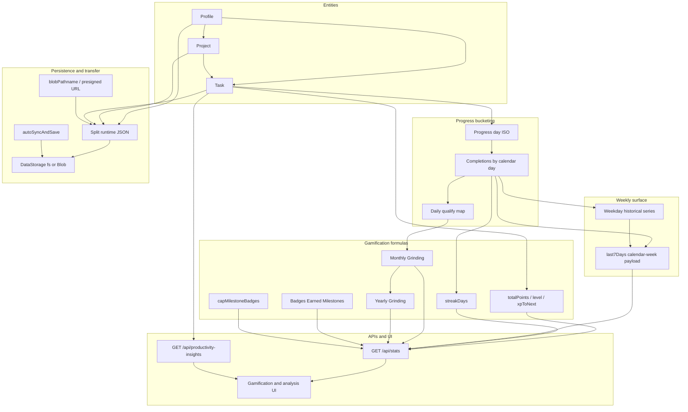

# Variables Documentation

**Last updated:** 2026-07-18  
**Owner:** Product Analytics + Engineering

This catalog defines core application variables with professional, implementation-aligned descriptions. Each entry includes the variable name, friendly name, definition, formula, location in the apps, and an example value.

---

## Variable Relationship Chart

---

## How to Read This Catalog

| Column | Meaning |
|---|---|
| **Variable Name** | Canonical identifier used in code or API payloads |
| **Friendly Name** | Human-readable label for product and analytics discussions |
| **Definition** | What the variable represents in product terms |
| **Formula** | Computation or generation rule (`n/a` when user-entered or opaque ID) |
| **App Location** | Primary files, routes, or UI surfaces |
| **Example** | Representative value |

---

## Entity Variables

### Profile Variables

| Variable Name | Friendly Name | Definition | Formula | App Location | Example |
|---|---|---|---|---|---|
| `profile.id` | Profile Identifier | Unique profile key used for scoping projects, tasks, and progress. | `PR-<13digit-ms>-<hex6>` | Backend profile routes; frontend active profile state | `PR-1777494302624-98735a` |
| `profile.name` | Profile Name | User-facing profile label; also used for policy gates (`Test`, performance toggle). | n/a | Profile hub; workspace selector; badge cards | `Rifqi Tjahyono` |
| `profile.title` | Profile Title | Secondary profile descriptor shown in headers and modals. | n/a | Profile hub; modal titles (`Profile: Name - Title`) | `Product Builder` |
| `profile.passwordHash` | Profile Security Hash | Optional hashed password for locked profile access and export control. | scrypt hash of password | `profileSecurity.ts`, profile unlock/delete/export | `$scrypt$...` |
| `pst.activeProfileId` | Active Profile Preference | Browser-persisted last selected profile id. | localStorage get/set | `frontend/src/App.tsx` | `PR-1777494302624-98735a` |

### Project Variables

| Variable Name | Friendly Name | Definition | Formula | App Location | Example |
|---|---|---|---|---|---|
| `project.id` | Project Identifier | Stable project key. | Normalized sequence | Project sidebar; task association | `P3` |
| `project.name` | Project Name | User-defined project label. | n/a | Project sidebar; filters; move dialog | `Workstream Alpha` |
| `project.profileId` | Project Profile Scope | Profile owner of the project. | n/a | Backend filters; frontend project loading | `PR-1777494302624-98735a` |

### Task Variables

| Variable Name | Friendly Name | Definition | Formula | App Location | Example |
|---|---|---|---|---|---|
| `task.id` | Task Identifier | Unique persisted task ID. | Generated id | Task CRUD APIs; list rendering | `t_89ab` |
| `task.title` | Task Title | Primary actionable label for a task. | n/a | Task card; editor; hovercard | `Prepare sprint plan` |
| `task.priority` | Priority | Urgency level for planning and XP scoring. | enum: `low` \| `medium` \| `high` \| `urgent` | Task UI; `scoreFor` in `/api/stats` | `high` |
| `task.dueDate` | Scheduled Date | Planned day for execution and preferred progress bucketing. | `YYYY-MM-DD` | List/calendar/progress bucketing | `2026-07-18` |
| `task.dueTime` | Scheduled Time | Planned start time. | `HH:mm` | Day agenda; time displays | `09:00` |
| `task.durationMinutes` | Duration Minutes | Planned effort duration. | integer minutes | Editor; agenda blocks; hover details | `90` |
| `task.repeat` | Recurrence Type | Repeat strategy for recurring tasks. | enum (daily/weekly/…/custom) | Recurrence logic and UI | `weekly` |
| `task.repeatEvery` | Recurrence Interval | Custom repeat interval factor. | positive integer | Custom repeat settings | `2` |
| `task.repeatUnit` | Recurrence Unit | Unit for custom interval. | enum | Recurrence settings | `week` |
| `task.labels` | Labels | Categorization tags. | string array | Chips; search/filter context | `["deep-work","planning"]` |
| `task.location` | Location Value | Optional location context text/URL payload. | n/a | Hovercard; editor | `Office` |
| `task.link` | External Links | Optional list of reference links. | string array | Hovercard; editor | `["https://example.com"]` |
| `task.profileId` | Task Profile Scope | Profile owner of the task. | Project/profile integrity rule | Backend scope filters; active profile | `PR-1777494302624-98735a` |
| `task.projectId` | Task Project Scope | Project association for grouping/filtering. | n/a | Project filters and cards | `P3` |
| `task.completed` | Completion Flag | Completion state for execution and scoring. | boolean toggle | List filters; stats APIs | `true` |
| `task.completedAt` | Completion Timestamp | Completion event timestamp. | `now()` on complete | Analytics; fallback progress day | `2026-07-18T12:01:00.000Z` |
| `task.parentId` | Series Parent ID | Deterministic recurring-series parent key. | Normalization function | Recurrence grouping | `20260718-3` |
| `task.childId` | Series Child ID | Sequence identifier within a recurring series. | Normalization function | Occurrence-level operations | `7` |

---

## Priority Scoring Variables

| Variable Name | Friendly Name | Definition | Formula | App Location | Example |
|---|---|---|---|---|---|
| `scoreFor(task)` | Priority XP Weight | Points awarded for a completed task based on priority. | `low=1`, `medium=2`, `high=3`, `urgent=4`, else `0` | `backend/src/index.ts` (`/api/stats`, insights) | `3` for `high` |
| `stats.pointsByPriority` | XP by Priority Band | Lifetime XP summed into priority buckets. | sum `scoreFor` per priority among completed tasks | `/api/stats` | `{ low: 12, medium: 40, high: 90, urgent: 28 }` |

---

## Derived Progress and Gamification Variables

| Variable Name | Friendly Name | Definition | Formula | App Location | Example |
|---|---|---|---|---|---|
| `completionDateIsoLocalForTask` | Progress Day | Day bucket key for completed task metrics. | Prefer `task.dueDate`; else local calendar date of `completedAt` | Backend stats and insights | `2026-07-18` |
| `stats.totalPoints` | Lifetime XP | Total weighted points over completed tasks in scope. | `sum(scoreFor(task))` | `/api/stats`; gamification UI | `420` |
| `stats.level` | Gamification Level | Progress level based on lifetime XP. | `1 + floor(totalPoints / 50)` | `/api/stats`; UI | `9` |
| `stats.xpToNext` | XP To Next Level | Remaining points until next level threshold. | If `totalPoints % 50 == 0` then `50`, else `50 - (totalPoints % 50)` | `/api/stats` | `30` |
| `stats.completedToday` | Completed Today | Completed tasks mapped to today’s progress day. | `count(progressDay == todayLocal)` | Gamification panel | `4` |
| `stats.pointsToday` | XP Today | XP earned on today’s progress day. | `sum(scoreFor)` for today’s completions | Gamification panel | `11` |
| `stats.streakDays` | Streak Days | Consecutive local days with ≥1 completion. | Backward count over progress-day buckets from today | Gamification panel | `6` |

---

## Policy and UX Variables

| Variable Name | Friendly Name | Definition | Formula | App Location | Example |
|---|---|---|---|---|---|
| `activeProfileName` | Active Profile Name | Currently selected profile name used for policy gates in UI. | `lookup(profile.id == activeProfileId).name` | `TaskBoard.tsx`, `ProjectSidebar.tsx` | `Test` |
| `isShowcaseReadOnlyActive` | Showcase Read-only Flag | Disables mutation interactions for profile `Test`. | `lower(trim(activeProfileName)) == "test"` | Task/project/profile components | `true` |
| `SHOWCASE_READONLY_MESSAGE` | Showcase Policy Message | Canonical backend message for blocked read-only mutations. | Constant string | `backend/src/index.ts` | `Showcase mode: profile "Test" is read-only...` |
| `getFriendlyErrorMessage` | Friendly Error Message | Human-readable error root cause shown in toaster UI. | Prefer backend error text; else fallback by HTTP status (incl. `413`) | `frontend/src/utils/friendlyError.ts` | `Verification failed. Please re-check your password...` |

---

## `/api/stats` Weekly Series and Tooltip Variables

The JSON key `last7Days` is a **legacy name**. Shipped behavior: an ordered array of **seven** objects for the **current calendar week** in the server’s local timezone (**Monday through Sunday**), not a rolling trailing-seven-day window.

| Variable Name | Friendly Name | Definition | Formula / Derivation | App Location | Example |
|---|---|---|---|---|---|
| `stats.last7Days` | Weekly Progress Series | Seven day-buckets for charting and achievement checks that iterate this array. | Week starts Monday 00:00 local; `i = 0..6` | `GET /api/stats`; `GamificationPanel.tsx` | Array length `7` |
| `stats.last7Days[].date` | Series Day | ISO calendar date for the bar. | Local `YYYY-MM-DD` | Stats payload; chart axis | `2026-07-13` |
| `stats.last7Days[].completed` | Completions Count | Tasks completed on that progress day. | Count where `completionDateIso === date` | Chart height; tooltip | `3` |
| `stats.last7Days[].points` | Day XP | Sum of priority weights for tasks completed that day. | `sum(scoreFor(task))` | Tooltip; achievements | `7` |
| `stats.last7Days[].taskXpMin` | Per-task XP Minimum | Smallest priority score among tasks completed that day. | `min(xps)` or `null` | Rich tooltip | `2` |
| `stats.last7Days[].taskXpMax` | Per-task XP Maximum | Largest priority score among tasks completed that day. | `max(xps)` or `null` | Rich tooltip | `4` |
| `stats.last7Days[].taskXpAvg` | Per-task XP Average | Mean priority score for tasks completed that day (one decimal). | `round((points / n) * 10) / 10` or `null` | Rich tooltip | `2.7` |
| `stats.last7Days[].weekdayTaskMin` | Weekday Historical Minimum | Min completions on this weekday across the filtered timeline (including zero days). | `min(count per weekday)` | Rich tooltip | `0` |
| `stats.last7Days[].weekdayTaskMax` | Weekday Historical Maximum | Max completions on this weekday over the same span. | `max(count per weekday)` | Rich tooltip | `5` |
| `stats.last7Days[].weekdayTaskAvg` | Weekday Historical Average | Mean completions for this weekday (one decimal). | `round(mean * 10) / 10` | Rich tooltip | `2.4` |

**Implementation note:** Achievements that loop over `last7Days` (for example Consistency Builder progress) use the **same seven calendar-week dates** as the weekly chart. Product copy that says “last seven days” should be reconciled with this behavior.

---

## Grinding and Milestone Variables

| Variable Name | Friendly Name | Definition | Formula | App Location | Example |
|---|---|---|---|---|---|
| `dailyQualifies` | Consistency Day Map | Map of ISO date → whether the day qualifies for Consistency Builder. | Derived from completion rules in stats builder | `monthlyGrinding.ts`, `yearlyGrinding.ts` | `Map{"2026-07-13" => true}` |
| `monthlyGrinding.monthKey` | Monthly Grinding Month | Calendar month under evaluation. | `YYYY-MM` from local month start | `computeMonthlyGrinding` | `2026-07` |
| `monthlyGrinding.weeksCompleted` | Monthly Grinding Weeks | Count of Monday-start weeks (Mon–Sun) whose Monday falls in the month and all 7 days qualify. | Count qualifying weeks | `monthlyGrinding.ts`; `/api/stats` | `3` |
| `monthlyGrinding.evidenceWeekStarts` | Monthly Evidence Mondays | ISO Mondays of qualifying weeks. | List of week starts | Stats / achievements | `["2026-07-06","2026-07-13"]` |
| `yearlyGrinding.year` | Yearly Grinding Year | Calendar year under evaluation. | Integer year | `yearlyGrinding.ts` | `2026` |
| `yearlyGrinding.monthsCompleted` | Yearly Grinding Months | Months that hit Monthly Grinding threshold. | Count months where `weeksCompleted >= 4` | `yearlyGrinding.ts`; `/api/stats` | `2` |
| `badgesEarned.milestones` | Badges Earned Tiers | Milestone thresholds for badges earned. | Every `5` from `5` to `750` (150 tiers) | `badgesEarnedMilestone.ts` | `[5,10,...,750]` |
| `badgesEarned.progressToNext` | Progress to Next Badge Tier | Fraction toward the next badges-earned milestone. | `(current - prev) / (next - prev)` clamped to `[0,1]`; `1` if no next | `buildBadgesEarnedMilestoneBlock` | `0.4` |
| `badgesEarned.recentUnlocked` | Recent Badge Tiers | Last up to six achieved badge tiers. | `achieved.slice(-6)` | Stats UI | `[20,25,30,35,40,45]` |
| `capMilestoneBadges(values, max)` | Capped Milestone List | Caps long milestone lists for UI while preserving dense early tiers and the final milestone. | Keep ~66% head; sample tail; always include last | `capMilestoneBadges.ts` | Length `maxBadges` |

---

## Storage, Environment, and Transfer Variables

| Variable Name | Friendly Name | Definition | Formula | App Location | Example |
|---|---|---|---|---|---|
| `STORAGE_BACKEND` | Storage Backend Selector | Forces persistence adapter. | `fs` \| `vercel-blob` \| unset (auto) | `createStorage.ts`; `.env` | `vercel-blob` |
| `BLOB_READ_WRITE_TOKEN` | Blob Credential | Read/write token for Vercel Blob. | Env secret | Storage + `blobTransfer.ts` | `vercel_blob_rw_...` |
| `BLOB_RUNTIME_PREFIX` | Runtime Blob Prefix | Pathname prefix for runtime JSON objects. | Default `focista-schedulo/runtime/` | `vercelBlobStorage.ts` | `focista-schedulo/runtime/` |
| `BLOB_ACCESS` | Blob Access Mode | Public vs private Blob access mode. | Default `private` | Blob clients | `private` |
| `FRONTEND_ORIGIN` | Allowed Frontend Origin | CORS lock for production API. | Required when `NODE_ENV`/`FOCISTA_ENV` is production | `backend/src/index.ts` | `https://app.vercel.app` |
| `VITE_API_BASE_URL` | Frontend API Base URL | API origin for split hosting. | Required on Vercel Production when split | `apiClient.ts`; frontend env | `https://api.example.com` |
| `import.blobPathname` | Import Blob Path | Staged import object pathname instead of inline content. | Exactly one of `content` or `blobPathname` | `POST /api/admin/import`; `App.tsx` | `focista-schedulo/imports/...` |
| `export.downloadUrl` | Export Presigned URL | Short-lived Blob URL for large export download. | Issued when inline body would exceed limits | `POST /api/admin/export-data`; `blobTransfer.ts` | `https://...blob.vercel-storage.com/...` |
| `autoSyncAndSave` | Automated Sync and Save | Client orchestration that syncs then saves after import (quiet optional). | Sequential admin calls | `frontend/src/App.tsx` | Quiet post-import run |
| `X-Server-Time-Ms` | Server Timing Header | Backend processing time for the request. | Middleware measured ms | Express middleware | `42` |

---

## Persistence Object Variables

| Variable Name | Friendly Name | Definition | Formula | App Location | Example |
|---|---|---|---|---|---|
| `tasks.runtime.json` | Tasks Runtime Store | Primary task persistence object. | Serialized task array/object | `backend/data/` or Blob prefix | Runtime file/object |
| `projects.runtime.json` | Projects Runtime Store | Primary project persistence object. | Serialized projects | Same | Runtime file/object |
| `profiles.runtime.json` | Profiles Runtime Store | Primary profile persistence object; fast-path boot load. | Serialized profiles | Same | Runtime file/object |
| `focista-unified-data.json` | Unified Interchange Snapshot | Import/export oriented snapshot, not primary mutation store. | Combined entities | Admin sync/import/export | Unified JSON |

---

## Notes on Source of Truth

- Runtime entity truth is persisted as split JSON objects (same schema on disk or in Vercel Blob).
- Local path: `backend/data/` when `STORAGE_BACKEND=fs` (default without Blob credentials).
- Prod path: Vercel Blob under `BLOB_RUNTIME_PREFIX` when `STORAGE_BACKEND=vercel-blob`.
- Metrics truth is computed server-side from persisted runtime entities.
- Unified JSON is interchange-oriented and not the primary runtime mutation store.
- Error-message source of truth is `frontend/src/utils/friendlyError.ts`.
- Weekly chart semantics source of truth is the `/api/stats` builder in `backend/src/index.ts` (calendar week under key `last7Days`).

---

## Related Documents

- Metrics: `PRODUCT_METRICS.md`
- OKRs: `METRICS_AND_OKRS.md`
- API: `API_CONTRACTS.md`
- Architecture: `ARCHITECTURE.md`
- Guardrails: `GUARDRAILS.md`
