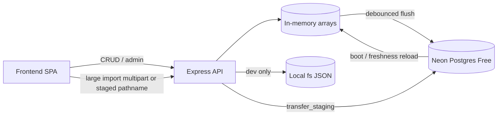

# Plan: Free-Tier Neon Postgres for Production

**Date:** 2026-07-19  
**Status:** Implemented (schema + adapter landed)  
**Schema decision:** [`2026-07-19-neon-schema-decision.md`](./2026-07-19-neon-schema-decision.md)  
**Migration SQL:** `backend/src/storage/migrations/001_neon_core.sql`

**Goal:** Use **Neon Postgres Free** as the production durable store for runtime persistence and large import/export staging, while keeping the current API/UI behavior and local `fs` for development.

---

## Decision

| Environment | Durable store | Large transfer staging | Multi-isolate freshness | Required env |
|---|---|---|---|---|
| **Prod** | **Neon Free** (`STORAGE_BACKEND=neon`) | Neon `transfer_staging` (+ **parts** export fallback) | Postgres `tasks_revision` via `SELECT` | **`DATABASE_URL`** (pooled) |
| **Local/dev** | `STORAGE_BACKEND=fs` (unchanged DX) | Inline content or local staging paths | `fs.watch` / process-local memory | Optional |

This is an **approved architecture change**: Neon Postgres is the Prod durable store; docs and guardrails reflect Neon + local `fs` only.

---

## Why Neon Free

- Row-per-task upserts avoid whole-document rewrite costs on every mutation.
- Cheap metadata peeks (`tasks_revision`) without external object-store list/put quotas.
- Free tier is permanent and fits a personal Prod when configured for **scale-to-zero** and **no keep-alive**.

### Neon Free constraints we design around

| Resource | Free limit | Design rule |
|---|---|---|
| Storage | **0.5 GB** / project | Prefer normalized rows; never keep duplicate full JSON dumps |
| Compute | **100 CU-hours** / month | **No** artificial keep-alive; accept cold start; use pooled serverless driver |
| Idle | Scale-to-zero after **5 min** (cannot disable) | In-memory working set still warms after first request; document cold-start UX |
| Egress | **5 GB** / month | Avoid shipping full task dumps; keep pagination / parts export |
| Branches | 10 / project | Use 1 main + optional preview branch only |

**Cold start:** First request after idle may add ~hundreds of ms–few seconds while Neon resumes. App already has `apiFetchWarming` / 503 warming patterns—reuse for DB wake.

---

## Non-goals

- No Redis / MongoDB
- No UI redesign
- No change to Task/Project/Profile Zod field names exposed to clients
- No git push/commit unless explicitly requested later

---

## Target architecture

**Working set:** Keep today’s in-memory `tasks` / `projects` / `profiles` for latency and SSE. Neon is the durable source of truth.

---

## Schema strategy (locked)

**Do not ship a whole-document `runtime_documents` primary store** — it re-creates multi-MB rewrite tax on Neon Free.

**Selected model:** row-per-task with canonical `payload jsonb` + generated filter columns. Full rationale and evidence: [`2026-07-19-neon-schema-decision.md`](./2026-07-19-neon-schema-decision.md). SQL: `backend/src/storage/migrations/001_neon_core.sql`.

| Table | Role |
|---|---|
| `profiles` / `projects` | Small relational tables |
| `tasks` | One row per task; `payload` = full `TaskSchema`; generated `profile_id`, `due_date`, `completed`, … |
| `runtime_meta` | `tasks_revision` etc. for multi-isolate freshness |
| `transfer_staging` | Large import/export staging with TTL |

Flush:
- Complete / single mutate → `UPDATE` one row + bump revision (same transaction)
- Batch → multi-row transaction + one revision bump
- Boot / freshness → `SELECT payload FROM tasks` when revision advances
- In-memory arrays remain the read working set (recurrence/stats unchanged)

---

## Storage selection & env

### Required / supported

| Variable | Purpose |
|---|---|
| `DATABASE_URL` | Neon **pooled** connection string (`-pooler` host) |
| `DATABASE_URL_UNPOOLED` | Optional, migrations only |
| `STORAGE_BACKEND` | `fs` \| `neon` \| `auto` |
| `NEON_FRESHNESS_TTL_MS` | Default `2000` — cooldown on revision peeks |
| `NEON_TRANSFER_TTL_HOURS` | Default `2` — staging expiry |
| `NEON_STATEMENT_TIMEOUT_MS` | Default `15000` — fail fast under cold/load |

### Auto selection

1. `STORAGE_BACKEND=fs` → fs  
2. `STORAGE_BACKEND=neon` → Neon (requires `DATABASE_URL`)  
3. `auto` → Neon if `DATABASE_URL` set, else fs  

### Free-tier Neon project settings (operator checklist)

1. Create Neon project (region near Vercel).
2. Enable **pooled** connection; copy `DATABASE_URL`.
3. Leave scale-to-zero **on** (Free cannot disable).
4. Do **not** configure external pingers / cron keep-alive (burns CU-hours).
5. Autoscaling max ≤ 2 CU (Free cap).
6. Single primary branch for Prod; avoid extra long-lived branches.
7. Run migrations once with unpooled URL if needed.

---

## API / frontend surface

| Area | Behavior |
|---|---|
| `POST /api/admin/transfer-upload` | Multipart/chunked upload → `transfer_staging` |
| Import | `stagingPathname` xor inline `content` |
| Export | `delivery: "staging"` with API download URL; keep `parts` / `inline` |
| Frontend | `transferImport.ts` — fetch multipart to API |
| `/health` | Report `storage: "neon"`, optional `db: { ok, cold?, lagMs }` |
| Freshness | `ensureTasksMemoryFresh` uses Neon `tasks_revision` |

Hobby **~4.5 MB** body limit still applies on Vercel Functions: large imports use staging upload endpoint that streams to Neon; large exports prefer staging download or **parts**.

---

## Migration path (data)

1. **Export** current Prod via admin export → unified/split JSON.
2. Deploy Neon schema.
3. **Import** once into Neon via admin import.
4. Flip `STORAGE_BACKEND=neon` + `DATABASE_URL`.
5. Verify `/health`, task list, complete, import, export parts/staging.
6. Prune staging rows on schedule.

Rollback: restore from Neon export / snapshot and redeploy prior release if needed.

---

## Implementation steps (completed)

### Step 1 — Apply locked schema + Neon client
- Use `001_neon_core.sql`
- Add `@neondatabase/serverless` (preferred on Vercel) or `pg` pool
- `STORAGE_BACKEND=neon` selection via `DATABASE_URL`

### Step 2 — Neon repository + persist/freshness
- Load/save profiles, projects, tasks against row tables
- Dirty-id (or full rebuild for import) flush; **complete = single-row update**
- Freshness via `runtime_meta.tasks_revision` + TTL
- Debounce: `VERCEL ? 0 : 200`
- Tests: complete persist, revision bump, reload

### Step 3 — Transfer staging
- Neon `transfer_staging` + admin upload/download routes
- Frontend `transferImport.ts`
- TTL prune on transfer paths

### Step 4 — Docs (required by product standards)
Updated: `ARCHITECTURE`, `DEPLOYMENT_VERCEL`, `GUARDRAILS`, `VARIABLES`, `PRD`, `TRACEABILITY`, `API_CONTRACTS`, `USER_STORIES`, `TEST_STRATEGY`, `CHANGELOG`, `README`, crosswalk, metrics.

---

## Tests

| Suite | Coverage |
|---|---|
| `neonStorage` | read/write/upsert/skip-hash/stat/list |
| Freshness | revision bump reloads; TTL suppresses peek |
| Transfer | stage → import → delete; export download; expiry prune |
| Complete persist | awaits flush on Vercel; durable row update |
| Regression | existing API/import/export parts tests |
| Free-tier safety | statement timeout; no unbounded staging growth |

Run backend vitest visibly before calling done.

---

## Risks & mitigations

| Risk | Mitigation |
|---|---|
| Neon cold start | Warming retries; clear `/health`; document idle behavior |
| CU-hour exhaustion | No keep-alive; debounce; single-row complete |
| 0.5 GB storage | Row-per-task; prune staging; no dual full dumps |
| SSE + multi-isolate | Keep freshness revision check |
| Large import on Hobby body | Multipart staging endpoint, not inline JSON |

---

## Success criteria

- Prod runs with **`STORAGE_BACKEND=neon`** and **`DATABASE_URL`**
- Task complete = **O(1) row update**
- Import/export work via Neon staging and/or parts
- Docs/guardrails state Neon Free as Prod durable store
- Backend tests green

---

## Approval

Schema is **locked** (row-per-task). **Status: Implemented** — Neon adapter, migrations, transfer staging, and documentation suite updates landed (2026-07-19).
